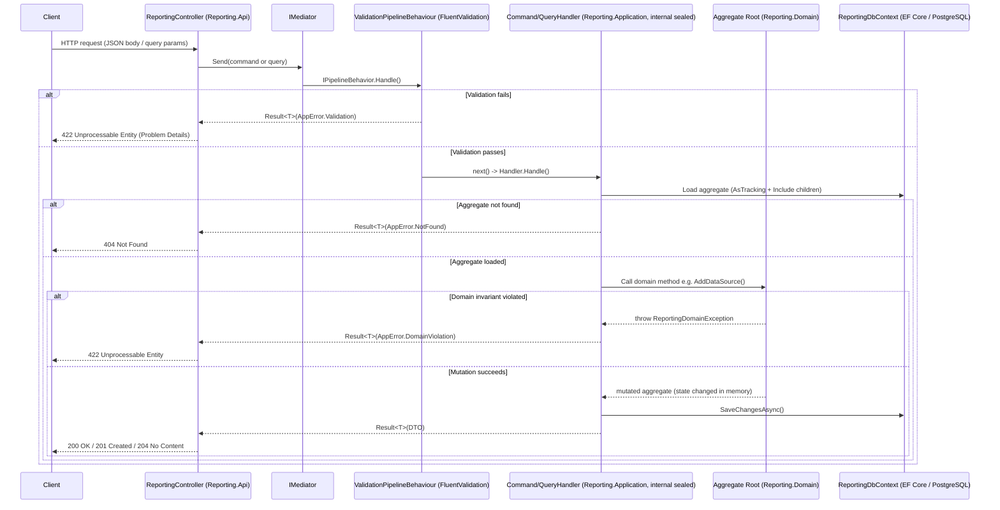
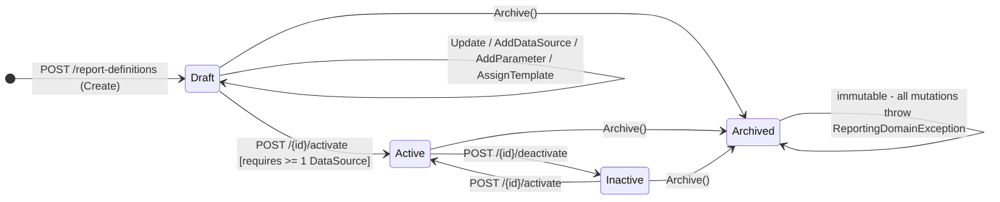
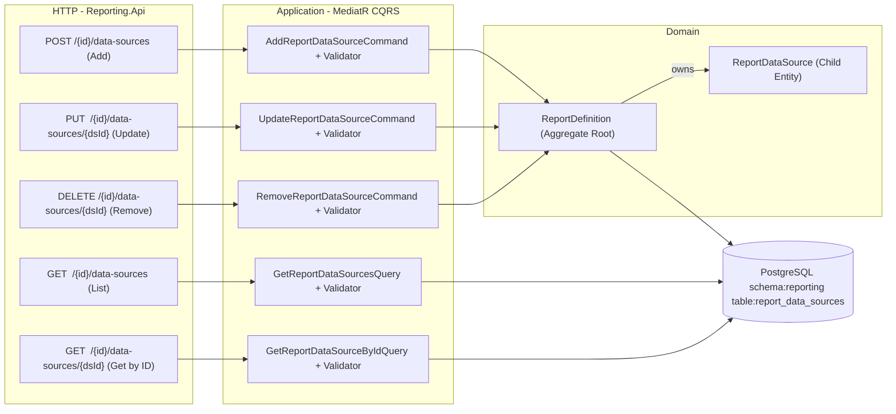
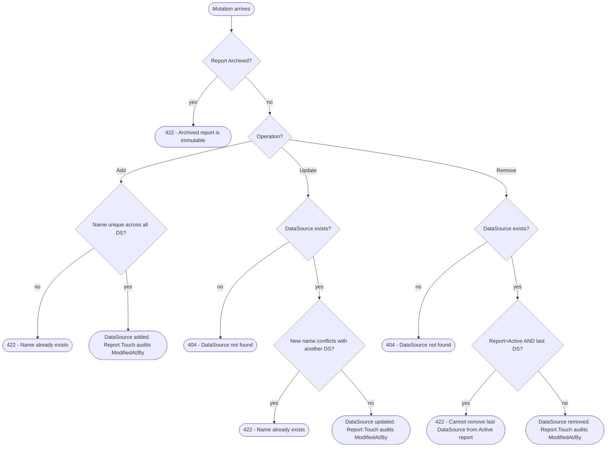
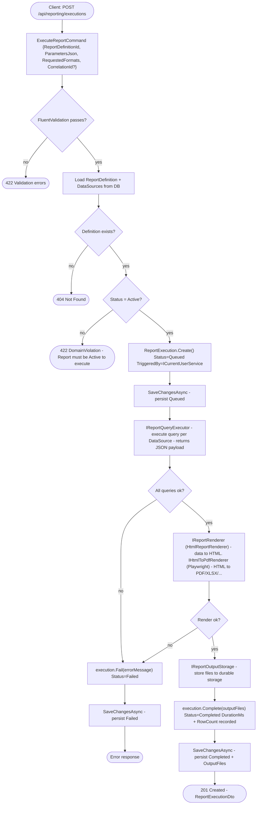
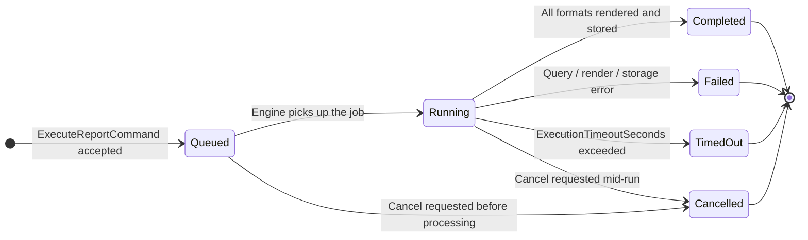

# ReportEngine

A **Modular Monolith** reporting platform built with **.NET 10**, following **Clean Architecture** and **Domain-Driven Design** principles. The system provides a complete lifecycle for defining, configuring, and executing data-driven reports with pluggable renderers and storage back-ends.

---

## Table of Contents

- [Architecture Overview](#architecture-overview)
- [Solution Structure](#solution-structure)
- [System Flow](#system-flow)
  - [Request Pipeline](#request-pipeline)
  - [Report Definition Lifecycle](#report-definition-lifecycle)
  - [DataSource CRUD Flow](#datasource-crud-flow)
  - [Report Execution Pipeline](#report-execution-pipeline)
  - [Execution State Machine](#execution-state-machine)
- [Modules](#modules)
  - [Reporting](#reporting-module)
  - [Labeling](#labeling-module)
  - [Printing](#printing-module)
  - [Designer](#designer-module)
  - [Scheduling](#scheduling-module)
  - [Dashboard](#dashboard-module)
  - [Templates](#templates-module)
- [Building Blocks](#building-blocks)
- [Hosts](#hosts)
- [Tech Stack](#tech-stack)
- [Getting Started](#getting-started)
- [API Reference](#api-reference)
- [Testing](#testing)
- [Contributing](#contributing)

---

## Architecture Overview

```
+---------------------------------------------------------------+
|                            Hosts                              |
|   ReportEngine.ApiHost (ASP.NET Core)                         |
|   ReportEngine.WorkerHost (.NET Worker Service)               |
+---------------------------------------------------------------+
         |  AddApplicationPart          |
         |  AddReportingApi()           |  BackgroundService
         |  AddLabelingInfrastructure() |
         |  AddTemplatesApi()           |
         v                             v
+---------------------------------------------------------------+
|                          Modules                              |
|                                                               |
|  Reporting    Labeling    Templates    Printing               |
|  +--------+   +--------+  +--------+  +--------+             |
|  | .Api   |   | .Api   |  | .Api   |  | .Api   |             |
|  | .App   |   | .App   |  | .App   |  | .App   |             |
|  | .Dom   |   | .Dom   |  | .Dom   |  | .Dom   |             |
|  | .Infra |   | .Infra |  | .Infra |  | .Infra |             |
|  +--------+   +--------+  +--------+  +--------+             |
|                                                               |
|  Designer     Scheduling    Dashboard                         |
+---------------------------------------------------------------+
                        |
+---------------------------------------------------------------+
|                   Building Blocks                             |
|  SharedKernel | Abstractions | Contracts | Infrastructure     |
+---------------------------------------------------------------+
```

Each module is **fully self-contained**: its own DB schema, EF Core migration history, and DI entry point.
Modules never reference each other directly — all cross-module communication goes through **BuildingBlocks** contracts.

---

## Solution Structure

```
Exim.ReportEngine/
├── src/
│   ├── Host/
│   │   ├── ReportEngine.ApiHost/              # ASP.NET Core 10 Web API
│   │   └── ReportEngine.WorkerHost/           # .NET Worker Service
│   │
│   ├── Modules/
│   │   ├── Reporting/
│   │   │   ├── Reporting.Api/                 # Controller, request models, DI entry AddReportingApi()
│   │   │   ├── Reporting.Application/         # Commands, queries, handlers, DTOs, validators
│   │   │   ├── Reporting.Domain/              # Aggregates, child entities, enums, Guards
│   │   │   └── Reporting.Infrastructure/      # EF Core DbContext, services, migrations
│   │   ├── Labeling/
│   │   │   ├── Labeling.Api/
│   │   │   ├── Labeling.Application/
│   │   │   ├── Labeling.Domain/
│   │   │   └── Labeling.Infrastructure/
│   │   ├── Templates/
│   │   │   ├── Templates.Api/
│   │   │   ├── Templates.Application/
│   │   │   ├── Templates.Domain/
│   │   │   └── Templates.Infrastructure/
│   │   ├── Printing/
│   │   ├── Designer/
│   │   ├── Scheduling/
│   │   └── Dashboard/
│   │
│   └── BuildingBlocks/
│       ├── ReportEngine.SharedKernel/         # Result<T>, AppError, PagedResult, ICurrentUserService
│       ├── ReportEngine.Abstractions/         # IRepository<TEntity, TId>
│       ├── ReportEngine.Contracts/            # Cross-module integration contracts
│       └── ReportEngine.Infrastructure/       # Shared infrastructure helpers
│
└── tests/
    └── Modules/
        ├── Reporting/
        │   ├── Reporting.Domain.UnitTests/      # 16 pure domain tests
        │   └── Reporting.Application.UnitTests/ # 14 handler tests (EF InMemory)
        ├── Printing/
        ├── Designer/
        ├── Scheduling/
        ├── Dashboard/
        └── Templates/
```

---

## System Flow

### Request Pipeline

Every HTTP request travels through the same vertical stack from controller down to the database.



**Key design points:**

- ValidationPipelineBehaviour<TRequest, TResponse> is an open-generic MediatR behaviour — no handler decoration needed.
- Handlers are internal sealed; exposed to test projects via [assembly: InternalsVisibleTo].
- All failure paths return Result<T> with a typed AppError — no exceptions cross layer boundaries.
- The Problem() helper in ReportingController maps AppError.Code to HTTP status codes via a switch expression.

---

### Report Definition Lifecycle



| Invariant | Where enforced |
|-----------|---------------|
| Name and Category non-empty, max 200 / 100 chars | Guard static class |
| Parameter names unique within a definition | ReportDefinition.AddParameter |
| DataSource names unique within a definition | ReportDefinition.AddDataSource / UpdateDataSource |
| Publish() requires at least one DataSource | ReportDefinition.Publish |
| Archived definitions are fully immutable | EnsureNotArchived() at every mutation entry point |
| Last DataSource on an Active report cannot be removed | ReportDefinition.RemoveDataSource |

---

### DataSource CRUD Flow

ReportDataSource is a **child entity** owned by the ReportDefinition aggregate root. All mutations go through the aggregate to enforce domain invariants.



**Guard flow for mutations:**



---

### Report Execution Pipeline

POST /api/reporting/executions triggers the full end-to-end processing pipeline.



---

### Execution State Machine



---

## Modules

### Reporting Module

The core module — manages the full lifecycle from report design to execution output.

#### Layer responsibilities

| Layer | Project | Responsibility |
|-------|---------|---------------|
| API | Reporting.Api | ReportingController, request/response models, DI entry point AddReportingApi() |
| Application | Reporting.Application | MediatR commands and queries, FluentValidation validators, DTOs, ValidationPipelineBehaviour |
| Domain | Reporting.Domain | ReportDefinition and ReportExecution aggregates, child entities, enums, Guard, ReportingDomainException |
| Infrastructure | Reporting.Infrastructure | ReportingDbContext (EF Core / Npgsql), EF configurations, migrations, service implementations |

#### Domain aggregates

| Aggregate | Child Entities | Description |
|-----------|---------------|-------------|
| ReportDefinition | ReportDataSource, ReportParameter | Design-time blueprint: name, category, template reference, data sources, parameters |
| ReportExecution | ReportOutputFile | Runtime run record: status, timing, parameters used, rendered output files |

#### Feature slices — ReportDefinitions

| Slice | Type | Method | Endpoint | Success |
|-------|------|--------|----------|---------|
| Create | Command | POST | /report-definitions | 201 + ReportDefinitionDto |
| Update | Command | PUT | /report-definitions/{id} | 200 + ReportDefinitionDto |
| Activate | Command | POST | /report-definitions/{id}/activate | 200 + ReportDefinitionDto |
| Deactivate | Command | POST | /report-definitions/{id}/deactivate | 200 + ReportDefinitionDto |
| AssignTemplate | Command | POST | /report-definitions/{id}/assign-template | 200 + ReportDefinitionDto |
| AddDataSource | Command | POST | /report-definitions/{id}/data-sources | 201 + ReportDataSourceDto |
| UpdateDataSource | Command | PUT | /report-definitions/{id}/data-sources/{dsId} | 200 + ReportDataSourceDto |
| RemoveDataSource | Command | DELETE | /report-definitions/{id}/data-sources/{dsId} | 204 No Content |
| GetDataSources | Query | GET | /report-definitions/{id}/data-sources | 200 + IReadOnlyList<ReportDataSourceDto> |
| GetDataSourceById | Query | GET | /report-definitions/{id}/data-sources/{dsId} | 200 + ReportDataSourceDto |
| AddParameter | Command | POST | /report-definitions/{id}/parameters | 200 + ReportDefinitionDto |
| GetById | Query | GET | /report-definitions/{id} | 200 + ReportDefinitionDto |
| GetList | Query | GET | /report-definitions | 200 + PagedResult<ReportDefinitionDto> |

**ReportDefinitions**

| Slice               | Type    | HTTP | Returns |
|---------------------|---------|-----------------|---------|
| `Create`            | Command | `POST /report-definitions` | `ReportDefinitionDto` |
| `Update`            | Command | `PUT /report-definitions/{id}` | `ReportDefinitionDto` |
| `Activate`          | Command | `POST /report-definitions/{id}/activate` | `ReportDefinitionDto` |
| `Deactivate`        | Command | `POST /report-definitions/{id}/deactivate` | `ReportDefinitionDto` |
| `AssignTemplate`    | Command | `POST /report-definitions/{id}/assign-template` | `ReportDefinitionDto` |
| `AddDataSource`     | Command | `POST /report-definitions/{id}/data-sources` | `ReportDefinitionDto` |
| `UpdateDataSource`  | Command | `PUT /report-definitions/{id}/data-sources/{dsId}` | `ReportDataSourceDto` |
| `RemoveDataSource`  | Command | `DELETE /report-definitions/{id}/data-sources/{dsId}` | `204 No Content` |
| `GetDataSources`    | Query   | `GET /report-definitions/{id}/data-sources` | `IReadOnlyList<ReportDataSourceDto>` |
| `GetDataSourceById` | Query   | `GET /report-definitions/{id}/data-sources/{dsId}` | `ReportDataSourceDto` |
| `AddParameter`      | Command | `POST /report-definitions/{id}/parameters` | `ReportDefinitionDto` |
| `GetById`           | Query   | `GET /report-definitions/{id}` | `ReportDefinitionDto` |
| `GetList`           | Query   | `GET /report-definitions` | `PagedResult<ReportDefinitionDto>` |

#### Feature slices — ReportExecutions

| Slice | Type | Method | Endpoint | Success |
|-------|------|--------|----------|---------|
| Execute | Command | POST | /executions | 201 + ReportExecutionDto |
| GetHistory | Query | GET | /executions | 200 + PagedResult<ReportExecutionDto> |

#### DTOs

| DTO | Key Fields |
|-----|-----------|
| ReportDefinitionDto | Id, Name, Description, Category, SubCategory, TemplateId, TemplatePath, Status, IsHidden, ExecutionTimeoutSeconds, MaxRowCount, Parameters[], DataSources[], audit fields |
| ReportDataSourceDto | Id, ReportDefinitionId, Name, DataSourceType, ConnectionStringName, QueryText, SortOrder |
| ReportParameterDto | Id, ReportDefinitionId, Name, DisplayName, ParameterType, IsRequired, DefaultValue, SortOrder, IsVisible, Description |
| ReportExecutionDto | Id, ReportDefinitionId, ReportName, ParametersJson, RequestedFormats[], Status, StartedAt, CompletedAt, DurationMs, ErrorMessage, RowCount, TriggeredBy, CorrelationId, OutputFiles[], audit fields |
| ReportOutputFileDto | Id, ExecutionId, Format, FilePath, FileSizeBytes, CreatedAt |

#### Enumerations

| Enum | Values |
|------|--------|
| ReportStatus | Draft · Active · Inactive · Archived |
| ReportDataSourceType | SqlQuery · StoredProcedure · WebService · Json · Xml · OData · InMemory · Custom |
| ReportParameterType | Text · WholeNumber · Numeric · Boolean · Date · DateTime · UniqueIdentifier · MultiValue · CascadingValue |
| ReportExecutionStatus | Queued · Running · Completed · Failed · Cancelled · TimedOut |
| ReportOutputFormat | Pdf · Excel · Word · Csv · Json · Xml · Html · Text |

#### Infrastructure service implementations

| Contract | Implementation | Scope | Notes |
|----------|---------------|-------|-------|
| IReportingDbContext | ReportingDbContext | Scoped | EF Core / Npgsql. Schema: 
eporting. |
| ICurrentUserService | HttpContextCurrentUserService | Scoped | Reads IHttpContextAccessor. |
| IReportQueryExecutor | NotImplementedReportQueryExecutor | Scoped | Stub — replace with real SQL/HTTP executor. |
| IReportRenderer | HtmlReportRenderer | Scoped | Renders report data to HTML using template. |
| IHtmlToPdfRenderer | PlaywrightHtmlToPdfRenderer | Singleton | Headless Chromium via Playwright. |
| IReportOutputStorage | NotImplementedReportStorageService | Scoped | Stub — replace with blob/file storage. |
| ITemplateVerifier | TemplateVerifier | Scoped | Cross-module call to Templates module. |

---

### Labeling Module

Manages product and asset labeling workflows.

- **Registered in host:** AddLabelingApplication() + AddLabelingInfrastructure(configuration).
- Database: LabelingDb connection string (PostgreSQL).
- Controllers are served directly from the ApiHost assembly.

---

### Printing Module

Handles print job scheduling and dispatch.

- All four layers: Printing.Api, Printing.Application, Printing.Domain, Printing.Infrastructure.
- Unit tests: Printing.Domain.UnitTests, Printing.Application.UnitTests.

---

### Designer Module

Report template visual design features.

- All four layers: Designer.Api, Designer.Application, Designer.Domain, Designer.Infrastructure.
- DesignerController registered in the host via AddApplicationPart.
- Unit tests: Designer.Domain.UnitTests, Designer.Application.UnitTests.

---

### Scheduling Module

Recurring job and cron-based report scheduling.

- All four layers present.
- Unit tests: Scheduling.Domain.UnitTests, Scheduling.Application.UnitTests.

---

### Dashboard Module

Aggregated metrics and KPI views.

- All four layers present.
- Unit tests: Dashboard.Domain.UnitTests, Dashboard.Application.UnitTests.

---

### Templates Module

Manages report template assets — file references and versioning.

- **Registered in host:** AddTemplatesApi(configuration).
- Database: TemplatesDb connection string.
- TemplatesController registered via AddApplicationPart.

---

## Building Blocks

### SharedKernel

| Type | Description |
|------|-------------|
| `Result<T>` | Discriminated union — success value **or** `AppError`. Implicit conversion from both. |
| `AppError` | Typed immutable error with `Code` + `Message`. Factories: `NotFound`, `Conflict`, `Validation`, `DomainViolation`, `Unexpected`. |
| `PagedResult<T>` | Paged envelope: `Items`, `TotalCount`, `Page`, `PageSize`, `TotalPages`, `HasNextPage`, `HasPreviousPage`. |
| `ICurrentUserService` | Abstracts authenticated identity. HTTP reads `IHttpContextAccessor`; background returns `"system"`. |
| `IDateTimeProvider` | Abstracts `DateTimeOffset.UtcNow` for deterministic testing. |

### Abstractions

| Type | Description |
|------|-------------|
| `IRepository<TEntity, TId>` | Generic contract: `GetByIdAsync`, `GetAllAsync`, `AddAsync`, `UpdateAsync`, `DeleteAsync`. |

---

## Hosts

### ApiHost — `ReportEngine.ApiHost`

ASP.NET Core 10 Web API. Entry point: `Program.cs`.

```csharp
builder.Services
    .AddControllers()
    .AddApplicationPart(typeof(ReportingController).Assembly)  // Reporting.Api
    .AddApplicationPart(typeof(TemplatesController).Assembly); // Templates.Api

builder.Services.AddLabelingApplication();
builder.Services.AddLabelingInfrastructure(configuration);
builder.Services.AddReportingApi(configuration);  // see chain below
builder.Services.AddTemplatesApi(configuration);
```

`AddReportingApi(config)` call chain:

```
AddReportingApi(config)
  +-- AddReportingInfrastructure(config)
  |     DbContext (Npgsql), IReportingDbContext, ICurrentUserService,
  |     IReportQueryExecutor, IReportRenderer, IHtmlToPdfRenderer,
  |     IReportOutputStorage, ITemplateVerifier, HtmlRendererOptions
  +-- AddReportingApplication()
        MediatR handlers, open-generic ValidationPipelineBehaviour,
        FluentValidation validators (all from assembly, includeInternalTypes: true)
```

- Swagger UI at `/swagger` in Development.
- `IHttpContextAccessor` registered for `ICurrentUserService`.

### WorkerHost — `ReportEngine.WorkerHost`

.NET 10 Generic Worker Service for background tasks (scheduled executions, event consumers).

- Extends `BackgroundService`.
- Containerised via `Dockerfile`.

---

## Tech Stack

| Concern | Technology |
|---------|-----------|
| Framework | .NET 10 |
| Web API | ASP.NET Core 10 |
| Background Service | .NET Generic Worker Host (`BackgroundService`) |
| CQRS / Mediator | MediatR 14 |
| Validation | FluentValidation 12 |
| ORM | Entity Framework Core 10 |
| Database | PostgreSQL 15+ via Npgsql provider |
| PDF Rendering | Playwright (headless Chromium) |
| API Documentation | Swashbuckle (Swagger / OpenAPI) |
| Logging | `Microsoft.Extensions.Logging` — compile-time `LoggerMessage.Define` source generation |
| Unit Testing | xUnit · Moq · EF Core InMemory |
| Package Management | Central Package Management (`Directory.Packages.props`) — no `Version=` in individual `.csproj` files |

---

## Getting Started

### Prerequisites

- [.NET 10 SDK](https://dotnet.microsoft.com/download/dotnet/10.0)
- PostgreSQL 15+
- Playwright Chromium (for PDF rendering)

```powershell
dotnet tool install --global Microsoft.Playwright.CLI
playwright install chromium
```

### Configuration

Edit `src/Host/ReportEngine.ApiHost/appsettings.json` or use user secrets / environment variables:

```json
{
  "ConnectionStrings": {
    "LabelingDb":  "Host=localhost;Port=5432;Database=LabelingDb;Username=dev;Password=dev",
    "ReportingDb": "Host=localhost;Port=5432;Database=ReportingDb;Username=dev;Password=dev",
    "TemplatesDb": "Host=localhost;Port=5432;Database=TemplatesDb;Username=dev;Password=dev"
  },
  "Reporting": {
    "HtmlRenderer": {
      "AssetBaseUrl": "http://localhost:5000"
    }
  }
}
```

### Apply Migrations

```powershell
# Reporting module  (PostgreSQL schema: reporting)
dotnet ef database update `
  --project src/Modules/Reporting/Reporting.Infrastructure `
  --startup-project src/Host/ReportEngine.ApiHost
```

### Run

```powershell
# API Host
dotnet run --project src/Host/ReportEngine.ApiHost

# Worker Host
dotnet run --project src/Host/ReportEngine.WorkerHost
```

Swagger UI: `https://localhost:{port}/swagger`

---

## API Reference

Base URL: `http(s)://host/api/reporting`

### Health

| Method | Endpoint | Description |
|--------|----------|-------------|
| `GET` | `/ping` | Returns `{ module, status, timestamp }` |

### Report Definitions

| Method | Endpoint | Query / Body | Success |
|--------|----------|-------------|---------|
| `GET` | `/report-definitions` | `?category` `?searchTerm` `?status` `?includeHidden` `?page` `?pageSize` | `200` |
| `GET` | `/report-definitions/{id}` | — | `200` |
| `POST` | `/report-definitions` | `{ name, category, description?, subCategory? }` | `201` |
| `PUT` | `/report-definitions/{id}` | `{ name, category, description?, subCategory? }` | `200` |
| `POST` | `/report-definitions/{id}/activate` | — | `200` |
| `POST` | `/report-definitions/{id}/deactivate` | — | `200` |
| `POST` | `/report-definitions/{id}/assign-template` | `{ templateId, templatePath }` | `200` |

### Data Sources

| Method | Endpoint | Body | Success |
|--------|----------|------|---------|
| `POST` | `/report-definitions/{id}/data-sources` | `{ name, dataSourceType, connectionStringName, queryText, sortOrder }` | `201` |
| `GET` | `/report-definitions/{id}/data-sources` | — | `200` |
| `GET` | `/report-definitions/{id}/data-sources/{dsId}` | — | `200` |
| `PUT` | `/report-definitions/{id}/data-sources/{dsId}` | `{ name, dataSourceType, connectionStringName, queryText, sortOrder }` | `200` |
| `DELETE` | `/report-definitions/{id}/data-sources/{dsId}` | — | `204` |

### Parameters

| Method | Endpoint | Body | Success |
|--------|----------|------|---------|
| `POST` | `/report-definitions/{id}/parameters` | `{ name, displayName, parameterType, isRequired, defaultValue?, sortOrder, isVisible, description? }` | `200` |

### Report Executions

| Method | Endpoint | Query / Body | Success |
|--------|----------|-------------|---------|
| `POST` | `/executions` | `{ reportDefinitionId, parametersJson, requestedFormats, correlationId? }` | `201` |
| `GET` | `/executions` | `?reportDefinitionId` `?triggeredBy` `?status` `?page` `?pageSize` | `200` |

### Error Responses

All failures conform to [RFC 9457 Problem Details](https://www.rfc-editor.org/rfc/rfc9457):

```json
{
  "title": "Conflict",
  "detail": "A data source named 'MainDataset' already exists on this report definition.",
  "status": 409
}
```

| `AppError.Code` | HTTP Status |
|----------------|------------|
| `*.NotFound` | `404 Not Found` |
| `Validation` | `422 Unprocessable Entity` |
| `Conflict` | `409 Conflict` |
| `DomainViolation` | `422 Unprocessable Entity` |
| anything else | `500 Internal Server Error` |

---

## Testing

```powershell
# All modules
dotnet test

# Reporting domain invariants only
dotnet test tests/Modules/Reporting/Reporting.Domain.UnitTests

# Reporting application handlers only
dotnet test tests/Modules/Reporting/Reporting.Application.UnitTests
```

### Test inventory — Reporting module

| Project | Test Class | Tests | Scope |
|---------|-----------|-------|-------|
| `Reporting.Domain.UnitTests` | `ReportDefinitionDataSourceTests` | 16 | Pure domain — aggregate invariants, guard clauses, lifecycle transitions, `Publish` precondition |
| `Reporting.Application.UnitTests` | `ReportDataSourceHandlerTests` | 14 | Application handlers — full execution with EF Core InMemory + Moq |

### Testing approach

| Layer | Strategy |
|-------|---------|
| **Domain** | Pure in-process. No mocks, no I/O. Exercises aggregate methods directly; asserts on state or caught `ReportingDomainException`. |
| **Application** | `InMemoryReportingDbContext` (EF Core InMemory provider) substitutes PostgreSQL. `ICurrentUserService` mocked with Moq. Handlers tested end-to-end including EF change tracker. |
| **Code quality** | All Roslyn CA rules are **fixed in code** — zero suppressions in `.editorconfig`. CA1707 → PascalCase test method names. CA1001 → `IDisposable` implemented alongside `IAsyncLifetime`. |

---

## Contributing

1. Branch with the `features/` prefix — e.g. `features/my-feature`.
2. Follow the **vertical-slice** pattern: new feature files go in `Features/<Aggregate>/<SliceName>/`.
3. Add a FluentValidation validator for every command and query.
4. Test method names must be **PascalCase** (CA1707 — no suppressions).
5. New cross-cutting types belong in `SharedKernel`, never inside a module.
6. Never add direct project-to-project references between modules.
7. Run `dotnet build` and `dotnet test` before opening a pull request.
