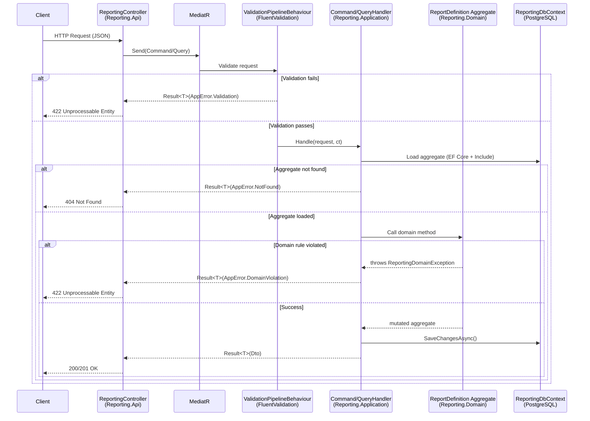
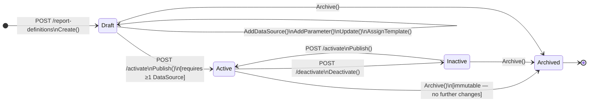
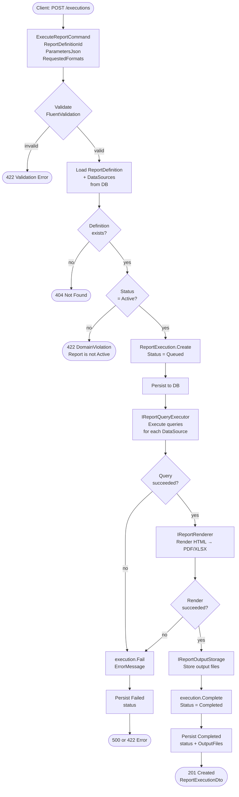
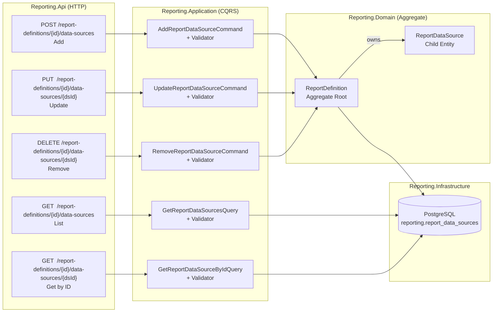
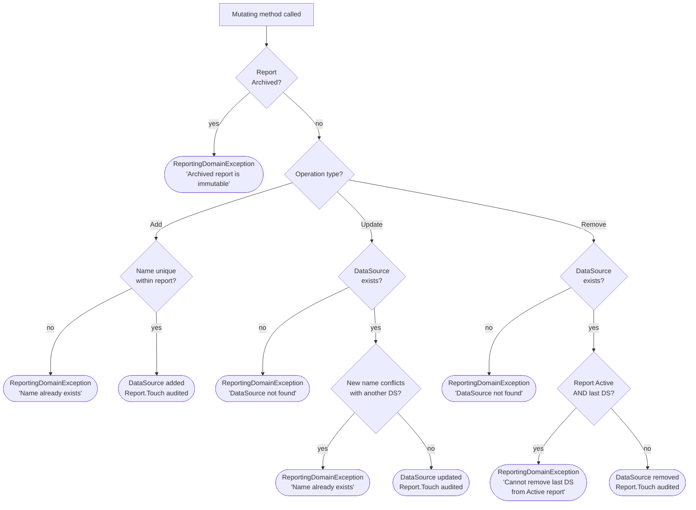
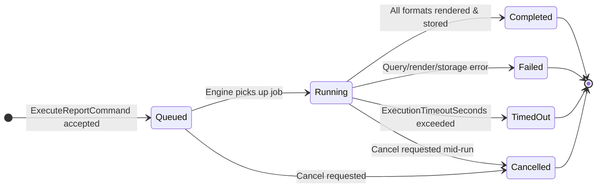

# ReportEngine

A **Modular Monolith** reporting platform built with **.NET 10**, following **Clean Architecture** and **Domain-Driven Design** principles. The system provides a full lifecycle for defining, configuring, and executing data-driven reports with pluggable renderers and storage back-ends.

---

## Table of Contents

- [Architecture Overview](#architecture-overview)
- [Solution Structure](#solution-structure)
- [System Flow](#system-flow)
  - [Request Pipeline](#request-pipeline)
  - [Report Definition Lifecycle](#report-definition-lifecycle)
  - [Report Execution Pipeline](#report-execution-pipeline)
  - [DataSource CRUD Flow](#datasource-crud-flow)
  - [Execution State Machine](#execution-state-machine)
- [Modules](#modules)
  - [Reporting](#reporting-module)
  - [Labeling](#labeling-module)
  - [Printing](#printing-module)
  - [Designer](#designer-module)
  - [Scheduling](#scheduling-module)
  - [Dashboard](#dashboard-module)
  - [Templates](#templates-module)
- [Building Blocks](#building-blocks)
- [Hosts](#hosts)
- [Tech Stack](#tech-stack)
- [Getting Started](#getting-started)
- [API Reference](#api-reference)
- [Testing](#testing)
- [Contributing](#contributing)

---

## Architecture Overview

```
┌─────────────────────────────────────────────────────────┐
│                        Hosts                            │
│   ApiHost (ASP.NET Core)   │   WorkerHost (.NET Worker) │
└───────────────┬─────────────────────────┬───────────────┘
                │                         │
┌───────────────▼─────────────────────────▼───────────────┐
│                       Modules                           │
│  Reporting │ Labeling │ Printing │ Designer │ ...       │
│  ┌────────┐ Each module contains:                       │
│  │  .Api  │  ← HTTP controllers / endpoints            │
│  │  .App  │  ← Commands, Queries (MediatR/CQRS)        │
│  │  .Dom  │  ← Aggregates, Entities, Domain Rules      │
│  │  .Inf  │  ← EF Core, Repositories, Services         │
│  └────────┘                                             │
└───────────────────────────┬─────────────────────────────┘
                            │
┌───────────────────────────▼─────────────────────────────┐
│                    Building Blocks                      │
│  SharedKernel │ Abstractions │ Contracts │ Infrastructure│
└─────────────────────────────────────────────────────────┘
```

Each module is **fully self-contained** — its own database schema, its own migration history, and its own DI registration entry point. Modules communicate only through well-defined contracts in the BuildingBlocks layer, never through direct project references to each other.

---

## Solution Structure

```
ReportEngine/
├── src/
│   ├── Host/
│   │   ├── ReportEngine.ApiHost/          # ASP.NET Core Web API host
│   │   └── ReportEngine.WorkerHost/       # .NET Worker Service host
│   │
│   ├── Modules/
│   │   ├── Reporting/
│   │   │   ├── Reporting.Api/             # Controllers, request/response models
│   │   │   ├── Reporting.Application/     # CQRS handlers, DTOs, validators, behaviours
│   │   │   ├── Reporting.Domain/          # Aggregates, enums, domain rules, guards
│   │   │   └── Reporting.Infrastructure/  # EF Core, services, migrations
│   │   ├── Labeling/
│   │   ├── Printing/
│   │   ├── Designer/
│   │   ├── Scheduling/
│   │   ├── Dashboard/
│   │   └── Templates/
│   │
│   └── BuildingBlocks/
│       ├── ReportEngine.SharedKernel/     # Result<T>, AppError, PagedResult, ICurrentUserService
│       ├── ReportEngine.Abstractions/     # IRepository<T>
│       ├── ReportEngine.Contracts/        # Cross-module contracts
│       └── ReportEngine.Infrastructure/  # Shared infrastructure helpers
│
└── tests/
    └── Modules/
        ├── Reporting/
        │   ├── Reporting.Domain.UnitTests/
        │   └── Reporting.Application.UnitTests/
        ├── Printing/
        ├── Designer/
        ├── Scheduling/
        ├── Dashboard/
        └── Templates/
```

---

## System Flow

### Request Pipeline

Every HTTP request travels through the same vertical stack before reaching the database.



---

### Report Definition Lifecycle

A `ReportDefinition` must pass through an explicit lifecycle before it can be executed.



> **Invariants enforced by the domain:**
> - `Publish()` requires at least one `DataSource`.
> - `Archived` definitions are fully immutable — all mutating methods throw `ReportingDomainException`.
> - The last `DataSource` on an `Active` report cannot be removed (must `Deactivate` first).

---

### Report Execution Pipeline

`POST /api/reporting/executions` triggers the full end-to-end pipeline.



---

### DataSource CRUD Flow

Each data source is a **child entity** of the `ReportDefinition` aggregate. All mutations go through the aggregate root to enforce domain invariants.



**Domain invariants on DataSource mutations:**



---

### Execution State Machine



---

## Modules

### Reporting Module

The core module — manages the full report lifecycle.

#### Domain Aggregates

| Aggregate | Child Entities | Description |
|-----------|---------------|-------------|
| `ReportDefinition` | `ReportDataSource`, `ReportParameter` | Blueprint: metadata, parameters, data sources, template reference |
| `ReportExecution` | `ReportOutputFile` | A single run: status tracking, timing, output files |

#### Feature Slices (`Reporting.Application/Features/`)

**ReportDefinitions**

| Slice               | Type    | HTTP | Returns |
|---------------------|---------|-----------------|---------|
| `Create`            | Command | `POST /report-definitions` | `ReportDefinitionDto` |
| `Update`            | Command | `PUT /report-definitions/{id}` | `ReportDefinitionDto` |
| `Activate`          | Command | `POST /report-definitions/{id}/activate` | `ReportDefinitionDto` |
| `Deactivate`        | Command | `POST /report-definitions/{id}/deactivate` | `ReportDefinitionDto` |
| `AssignTemplate`    | Command | `POST /report-definitions/{id}/assign-template` | `ReportDefinitionDto` |
| `AddDataSource`     | Command | `POST /report-definitions/{id}/data-sources` | `ReportDefinitionDto` |
| `UpdateDataSource`  | Command | `PUT /report-definitions/{id}/data-sources/{dsId}` | `ReportDataSourceDto` |
| `RemoveDataSource`  | Command | `DELETE /report-definitions/{id}/data-sources/{dsId}` | `204 No Content` |
| `GetDataSources`    | Query   | `GET /report-definitions/{id}/data-sources` | `IReadOnlyList<ReportDataSourceDto>` |
| `GetDataSourceById` | Query   | `GET /report-definitions/{id}/data-sources/{dsId}` | `ReportDataSourceDto` |
| `AddParameter`      | Command | `POST /report-definitions/{id}/parameters` | `ReportDefinitionDto` |
| `GetById`           | Query   | `GET /report-definitions/{id}` | `ReportDefinitionDto` |
| `GetList`           | Query   | `GET /report-definitions` | `PagedResult<ReportDefinitionDto>` |

**ReportExecutions**

| Slice | Type | HTTP | Returns |
|-------|------|------|---------|
| `Execute` | Command | `POST /executions` | `ReportExecutionDto` |
| `GetHistory` | Query | `GET /executions` | `PagedResult<ReportExecutionDto>` |

#### Data Source Types

| Enum Value | Description |
|-----------|-------------|
| `SqlQuery` | Direct SQL `SELECT` against a named connection string |
| `StoredProcedure` | Schema-qualified stored procedure name |
| `WebService` | REST/SOAP endpoint path or operation name |
| `Json` | JSONPath selector or static payload |
| `Xml` | XPath selector or static document |
| `OData` | OData v4 query string options |
| `InMemory` | .NET object model provided by host |
| `Custom` | Pluggable data source registered via extension API |

#### Infrastructure Services

| Interface | Current Implementation | Description |
|-----------|----------------------|-------------|
| `IReportingDbContext` | `ReportingDbContext` (EF Core / PostgreSQL) | Unit-of-work |
| `IReportQueryExecutor` | `NotImplementedReportQueryExecutor` | Executes DS queries → JSON payload |
| `IReportRenderer` | `HtmlReportRenderer` | Renders data → HTML then to target format |
| `IHtmlToPdfRenderer` | `PlaywrightHtmlToPdfRenderer` | HTML → PDF via Playwright headless |
| `IReportOutputStorage` | `NotImplementedReportStorageService` | Persists rendered files |
| `ICurrentUserService` | `HttpContextCurrentUserService` | Resolves authenticated user identity |
| `ITemplateVerifier` | `TemplateVerifier` | Validates template existence before execution |

---

### Labeling Module

Manages product/asset labeling workflows. Integrated into the API host via `AddLabelingInfrastructure`.

---

### Printing Module

Handles print job scheduling and dispatch. Contains its own domain model with unit tests.

---

### Designer Module

Report template visual design features. Includes domain and application unit tests.

---

### Scheduling Module

Recurring job and cron-based scheduling. Contains domain and application test suites.

---

### Dashboard Module

Aggregated metrics and KPI views. Contains domain and application test suites.

---

### Templates Module

Manages report template assets (file references, versioning). Exposes controllers via `TemplatesController`.

---

## Building Blocks

### SharedKernel

Cross-cutting primitives used by all modules:

| Type | Description |
|------|-------------|
| `Result<T>` | Discriminated union — success value **or** `AppError`; implicit conversion from both |
| `AppError` | Typed immutable error: `NotFound`, `Conflict`, `Validation`, `DomainViolation`, `Unexpected` |
| `PagedResult<T>` | Paged envelope with `TotalPages`, `HasNextPage`, `HasPreviousPage` |
| `ICurrentUserService` | Abstracts authenticated user identity (HTTP context or `"system"` for background) |
| `IDateTimeProvider` | Abstracts `DateTimeOffset.UtcNow` for deterministic testing |

### Abstractions

| Type | Description |
|------|-------------|
| `IRepository<TEntity, TId>` | Generic repository contract: `GetByIdAsync`, `GetAllAsync`, `AddAsync`, `UpdateAsync`, `DeleteAsync` |

---

## Hosts

### ApiHost (`ReportEngine.ApiHost`)

ASP.NET Core Web API that composes all module controllers.

- Registers module services via `AddReportingApi()`, `AddLabelingInfrastructure()`, `AddTemplatesApi()`.
- Exposes Swagger/OpenAPI at `/swagger` in development.
- Loads controllers from module assemblies via `AddApplicationPart`.
- Configures `IHttpContextAccessor` for `ICurrentUserService`.

### WorkerHost (`ReportEngine.WorkerHost`)

.NET Worker Service for background processing (scheduled report runs, event consumers, etc.).

- Implements `BackgroundService`.
- Containerised via `Dockerfile`.

---

## Tech Stack

| Concern | Library / Technology |
|---------|---------------------|
| Framework | .NET 10 |
| Web API | ASP.NET Core 10 |
| Background Service | .NET Generic Worker Host |
| CQRS / Mediator | MediatR 14 |
| Validation | FluentValidation 12 |
| ORM | Entity Framework Core 10 |
| Database | PostgreSQL (Npgsql provider) |
| PDF Rendering | Playwright (headless Chromium) |
| API Documentation | Swashbuckle / OpenAPI |
| Logging | `Microsoft.Extensions.Logging` — compile-time `LoggerMessage.Define` |
| Unit Testing | xUnit + FluentAssertions + Moq + EF Core InMemory |
| Package Management | Central Package Management (`Directory.Packages.props`) |

---

## Getting Started

### Prerequisites

- [.NET 10 SDK](https://dotnet.microsoft.com/download/dotnet/10.0)
- PostgreSQL 15+
- Playwright browsers (for PDF rendering): `playwright install chromium`

### Configuration

Update `src/Host/ReportEngine.ApiHost/appsettings.json` or use user secrets:

```json
{
  "ConnectionStrings": {
    "LabelingDb":  "Host=localhost;Port=5432;Database=LabelingDb;Username=dev;Password=dev",
    "ReportingDb": "Host=localhost;Port=5432;Database=ReportingDb;Username=dev;Password=dev",
    "TemplatesDb": "Host=localhost;Port=5432;Database=ReportingDb;Username=dev;Password=dev"
  },
  "Reporting": {
    "HtmlRenderer": {
      "AssetBaseUrl": "http://localhost:5000"
    }
  }
}
```

### Apply Migrations

```powershell
# Reporting module
dotnet ef database update `
  --project src/Modules/Reporting/Reporting.Infrastructure `
  --startup-project src/Host/ReportEngine.ApiHost
```

### Run the API Host

```powershell
dotnet run --project src/Host/ReportEngine.ApiHost
```

Swagger UI → `https://localhost:{port}/swagger`

### Run the Worker Host

```powershell
dotnet run --project src/Host/ReportEngine.WorkerHost
```

---

## API Reference

Base URL: `/api/reporting`

### Report Definitions

| Method | Endpoint | Description | Success |
|--------|----------|-------------|---------|
| `GET` | `/report-definitions` | Paged list (`category`, `searchTerm`, `status`, `includeHidden`, `page`, `pageSize`) | 200 |
| `GET` | `/report-definitions/{id}` | Full definition with parameters & data sources | 200 |
| `POST` | `/report-definitions` | Create in `Draft` status | 201 |
| `PUT` | `/report-definitions/{id}` | Update name, category, description | 200 |
| `POST` | `/report-definitions/{id}/activate` | `Draft`/`Inactive` → `Active` | 200 |
| `POST` | `/report-definitions/{id}/deactivate` | `Active` → `Inactive` | 200 |
| `POST` | `/report-definitions/{id}/assign-template` | Attach template file reference | 200 |

### DataSources

| Method | Endpoint | Description | Success |
|--------|----------|-------------|---------|
| `POST` | `/report-definitions/{id}/data-sources` | Add a new data source | 201 |
| `GET` | `/report-definitions/{id}/data-sources` | List all data sources (ordered by `sortOrder`) | 200 |
| `GET` | `/report-definitions/{id}/data-sources/{dsId}` | Get single data source | 200 |
| `PUT` | `/report-definitions/{id}/data-sources/{dsId}` | Update all mutable fields | 200 |
| `DELETE` | `/report-definitions/{id}/data-sources/{dsId}` | Remove data source | 204 |

### Parameters

| Method | Endpoint | Description | Success |
|--------|----------|-------------|---------|
| `POST` | `/report-definitions/{id}/parameters` | Add an input parameter | 200 |

### Report Executions

| Method | Endpoint | Description | Success |
|--------|----------|-------------|---------|
| `POST` | `/executions` | Execute a report (trigger full pipeline) | 201 |
| `GET` | `/executions` | Paged history (`reportDefinitionId`, `triggeredBy`, `status`, `page`, `pageSize`) | 200 |

### Error Responses

All failures follow [RFC 9457 Problem Details](https://www.rfc-editor.org/rfc/rfc9457):

```json
{
  "title": "Conflict",
  "detail": "A data source named 'MainDataset' already exists on this report definition.",
  "status": 409
}
```

| `AppError.Code` | HTTP Status |
|----------------|------------|
| `*.NotFound` | 404 |
| `Validation` | 422 |
| `Conflict` | 409 |
| `DomainViolation` | 422 |
| anything else | 500 |

---

## Testing

```powershell
# Run all tests
dotnet test

# Reporting module only
dotnet test tests/Modules/Reporting/Reporting.Domain.UnitTests
dotnet test tests/Modules/Reporting/Reporting.Application.UnitTests
```

### Test coverage — Reporting module

| Test Class | Tests | Layer | What is covered |
|-----------|-------|-------|----------------|
| `ReportDefinitionDataSourceTests` | 16 | Domain | `AddDataSource`, `UpdateDataSource`, `RemoveDataSource` — all invariants, guard clauses, archived immutability, `Publish` precondition |
| `ReportDataSourceHandlerTests` | 14 | Application | All 4 handlers (Get list, Get by Id, Update, Remove) — happy path + every error path via EF InMemory |

### Testing approach

- **Domain tests** — pure in-memory, no mocks, exercise aggregate invariants directly.
- **Application tests** — use **EF Core InMemory** provider (`InMemoryReportingDbContext`) and **Moq** for `ICurrentUserService`. Handlers are tested end-to-end through the full application layer including persistence.
- **No suppression** — all CA rules (CA1707, CA1001) are **fixed in code**, not suppressed in `.editorconfig`.

---

## Contributing

1. Branch from `features/` prefix (e.g. `features/my-feature`).
2. Follow the vertical-slice pattern — new feature files go in `Features/<Aggregate>/<SliceName>/`.
3. Add a FluentValidation validator for every command/query.
4. All test method names must be **PascalCase** (CA1707 — no underscores).
5. New cross-cutting types belong in `SharedKernel`, not inside a module.
6. Do not add direct project references between modules.
7. Run `dotnet build` and `dotnet test` before opening a pull request.

- [Tech Stack](#tech-stack)
- [Getting Started](#getting-started)
- [API Reference](#api-reference)
- [Testing](#testing)
- [Contributing](#contributing)

---

## Architecture Overview

```
┌─────────────────────────────────────────────────────────┐
│                        Hosts                            │
│   ApiHost (ASP.NET Core)   │   WorkerHost (.NET Worker) │
└───────────────┬─────────────────────────┬───────────────┘
                │                         │
┌───────────────▼─────────────────────────▼───────────────┐
│                       Modules                           │
│  Reporting │ Labeling │ Printing │ Designer │ ...       │
│  ┌────────┐ Each module contains:                       │
│  │  .Api  │  ← HTTP controllers / endpoints            │
│  │  .App  │  ← Commands, Queries (MediatR/CQRS)        │
│  │  .Dom  │  ← Aggregates, Entities, Domain Events     │
│  │  .Inf  │  ← EF Core, Repositories, Services         │
│  └────────┘                                             │
└───────────────────────────┬─────────────────────────────┘
                            │
┌───────────────────────────▼─────────────────────────────┐
│                    Building Blocks                      │
│  SharedKernel │ Abstractions │ Contracts │ Infrastructure│
└─────────────────────────────────────────────────────────┘
```

Each module is **fully self-contained** — its own database schema, its own migration history, and its own DI registration entry point. Modules communicate only through well-defined contracts in the BuildingBlocks layer, never through direct project references to each other.

---

## Solution Structure

```
ReportEngine/
├── src/
│   ├── Host/
│   │   ├── ReportEngine.ApiHost/          # ASP.NET Core Web API host
│   │   └── ReportEngine.WorkerHost/       # .NET Worker Service host
│   │
│   ├── Modules/
│   │   ├── Reporting/
│   │   │   ├── Reporting.Api/                  # Controllers, request models
│   │   │   ├── Reporting.Application/          # CQRS handlers, DTOs, validators
│   │   │   ├── Reporting.Domain/               # Aggregates, enums, domain rules
│   │   │   └── Reporting.Infrastructure/       # EF Core, services, migrations
│   │   ├── Labeling/
│   │   ├── Printing/
│   │   ├── Designer/
│   │   ├── Scheduling/
│   │   ├── Dashboard/
│   │   └── Templates/
│   │
│   └── BuildingBlocks/
│       ├── ReportEngine.SharedKernel/     # Result<T>, AppError, PagedResult, ICurrentUserService, IDateTimeProvider
│       ├── ReportEngine.Abstractions/     # IRepository<T>
│       ├── ReportEngine.Contracts/        # Cross-module contracts
│       └── ReportEngine.Infrastructure/  # Shared infrastructure helpers
│
└── tests/
    └── Modules/
        ├── Reporting/
        │   ├── Reporting.Domain.UnitTests/
        │   └── Reporting.Application.UnitTests/
        ├── Printing/
        ├── Designer/
        ├── Scheduling/
        ├── Dashboard/
        └── Templates/
```

---

## Modules

### Reporting Module

The core module — manages the full report lifecycle.

#### Domain concepts

| Aggregate | Description |
|-----------|-------------|
| `ReportDefinition` | Blueprint for a report: metadata, parameters, data sources, template reference |
| `ReportExecution` | A single run of a report definition, with status tracking and output files |

#### Feature slices (`Reporting.Application/Features/`)

**ReportDefinitions**

| Slice | Type | Description |
|-------|------|-------------|
| `Create` | Command | Creates a new definition in `Draft` status |
| `Update` | Command | Updates name, category, description |
| `Activate` | Command | Transitions `Draft`/`Inactive` → `Active` |
| `Deactivate` | Command | Transitions `Active` → `Inactive` |
| `AddDataSource` | Command | Attaches a data source (SQL/SP/HTTP) to a definition |
| `AddParameter` | Command | Declares an input parameter on a definition |
| `GetById` | Query | Returns a full definition with parameters and data sources |
| `GetList` | Query | Returns a paged, filtered list of definitions |

**ReportExecutions**

| Slice | Type | Description |
|-------|------|-------------|
| `Execute` | Command | Runs the full pipeline: validate → query → render → store |
| `GetHistory` | Query | Returns a paged, filtered execution history |

#### Contracts (`Reporting.Application/Contracts/`)

| Interface | Responsibility |
|-----------|---------------|
| `IReportingDbContext` | EF Core unit-of-work abstraction |
| `IReportQueryExecutor` | Executes data source queries, returns JSON payload |
| `IReportRenderer` | Renders data payload into binary output (PDF, XLSX, …) |
| `IReportOutputStorage` | Persists rendered files to durable storage |

#### Report status lifecycle

```
Draft ──► Active ──► Inactive
  ▲                     │
  └─────────────────────┘  (re-activate)
```

---

### Labeling Module

Manages product/asset labeling workflows. Integrated into the API host.

---

### Printing Module

Handles print job scheduling and dispatch. Contains its own domain model with unit tests.

---

### Designer Module

Report template visual design features. Includes domain and application unit tests.

---

### Scheduling Module

Recurring job and cron-based scheduling. Contains domain and application test suites.

---

### Dashboard Module

Aggregated metrics and KPI views. Contains domain and application test suites.

---

### Templates Module

Manages report template assets (file references, versioning).

---

## Building Blocks

### SharedKernel

Cross-cutting primitives used by all modules:

| Type | Description |
|------|-------------|
| `Result<T>` | Discriminated union — success value or `AppError` |
| `AppError` | Typed, immutable error descriptor with factory methods (`NotFound`, `Conflict`, `Validation`, `DomainViolation`) |
| `PagedResult<T>` | Paged envelope for list queries |
| `ICurrentUserService` | Abstracts the authenticated user identity (HTTP or background worker) |
| `IDateTimeProvider` | Abstracts `DateTimeOffset.UtcNow` for deterministic testing |

### Abstractions

| Type | Description |
|------|-------------|
| `IRepository<T>` | Generic repository contract |

---

## Hosts

### ApiHost (`ReportEngine.ApiHost`)

ASP.NET Core Web API that composes all module controllers.

- Registers module services via `AddReportingApi()`, `AddLabelingInfrastructure()`, etc.
- Exposes Swagger/OpenAPI at `/swagger` in development.
- Loads controllers from module assemblies via `AddApplicationPart`.

### WorkerHost (`ReportEngine.WorkerHost`)

.NET Worker Service for background processing (scheduled report runs, event consumers, etc.).

- Implements `BackgroundService`.
- Containerised via `Dockerfile`.

---

## Tech Stack

| Concern | Library / Technology |
|---------|---------------------|
| Framework | .NET 10 |
| Web API | ASP.NET Core 10 |
| Background Service | .NET Generic Worker Host |
| CQRS / Mediator | MediatR |
| Validation | FluentValidation |
| ORM | Entity Framework Core 10 |
| Database | PostgreSQL (Npgsql provider) |
| API Documentation | Swashbuckle / OpenAPI |
| Dependency Injection | Microsoft.Extensions.DependencyInjection |
| Logging | Microsoft.Extensions.Logging (structured, `LoggerMessage.Define`) |
| Testing | xUnit (inferred from test projects) |

---

## Getting Started

### Prerequisites

- [.NET 10 SDK](https://dotnet.microsoft.com/download/dotnet/10.0)
- PostgreSQL instance (see connection strings below)

### Configuration

Update `src/Host/ReportEngine.ApiHost/appsettings.json` (or use user secrets / environment variables):

```json
{
  "ConnectionStrings": {
    "LabelingDb":  "Host=localhost;Port=5432;Database=LabelingDb;Username=dev;Password=dev",
    "ReportingDb": "Host=localhost;Port=5432;Database=ReportingDb;Username=dev;Password=dev"
  }
}
```

### Apply Migrations

```powershell
# Reporting module
dotnet ef database update `
  --project src/Modules/Reporting/Reporting.Infrastructure `
  --startup-project src/Host/ReportEngine.ApiHost
```

### Run the API Host

```powershell
dotnet run --project src/Host/ReportEngine.ApiHost
```

Swagger UI: `https://localhost:{port}/swagger`

### Run the Worker Host

```powershell
dotnet run --project src/Host/ReportEngine.WorkerHost
```

---

## API Reference

Base URL: `/api/reporting`

### Report Definitions

| Method | Endpoint | Description |
|--------|----------|-------------|
| `GET` | `/report-definitions` | Paged list — query params: `category`, `searchTerm`, `status`, `includeHidden`, `page`, `pageSize` |
| `GET` | `/report-definitions/{id}` | Get by id (includes parameters & data sources) |
| `POST` | `/report-definitions` | Create (`name`, `category`, `description?`, `subCategory?`) |
| `PUT` | `/report-definitions/{id}` | Update metadata |
| `POST` | `/report-definitions/{id}/activate` | Activate |
| `POST` | `/report-definitions/{id}/deactivate` | Deactivate |
| `POST` | `/report-definitions/{id}/data-sources` | Add data source |
| `POST` | `/report-definitions/{id}/parameters` | Add parameter |

### Report Executions

| Method | Endpoint | Description |
|--------|----------|-------------|
| `POST` | `/executions` | Execute a report (`reportDefinitionId`, `parametersJson`, `requestedFormats`, `correlationId?`) |
| `GET` | `/executions` | Paged history — query params: `reportDefinitionId`, `triggeredBy`, `status`, `page`, `pageSize` |

### Error responses

All failure responses follow [RFC 9457 Problem Details](https://www.rfc-editor.org/rfc/rfc9457):

```json
{
  "title": "Conflict",
  "detail": "A report named 'Sales Summary' already exists in category 'Finance'.",
  "status": 409
}
```

| `AppError.Code` | HTTP Status |
|----------------|------------|
| `*.NotFound` | 404 |
| `Validation` | 422 |
| `Conflict` | 409 |
| `DomainViolation` | 422 |
| anything else | 500 |

---

## Testing

```powershell
# Run all tests
dotnet test

# Run a specific module
dotnet test tests/Modules/Reporting/Reporting.Application.UnitTests
```

Test projects mirror the source structure under `tests/Modules/`.

---

## Contributing

1. Branch from `develop`.
2. Follow the vertical-slice pattern — new features go in `Features/<Aggregate>/<SliceName>/`.
3. Add a FluentValidation validator for every command/query.
4. New cross-cutting types belong in `SharedKernel`, not inside a module.
5. Do not add direct project references between modules.
6. Run `dotnet build` and `dotnet test` before opening a pull request.
